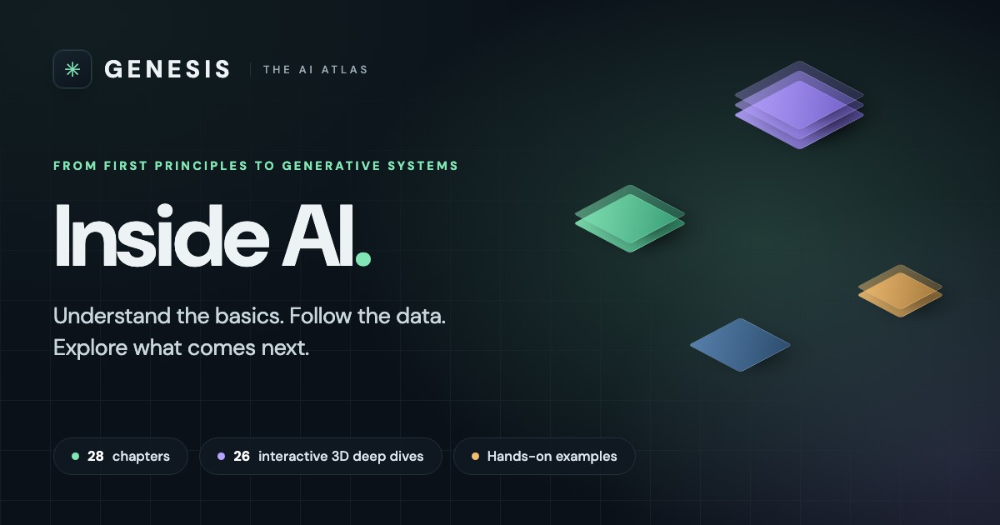

# GENESIS, the AI Atlas

An interactive map of how AI actually works, from what a model is to how a modern
generative system runs. 28 chapters, 26 of them opening into an explorable 3D scene
you can orbit, zoom and step through one operation at a time.

**Live at [atlas.sayangupta.in](https://atlas.sayangupta.in)**

## Why it exists

Most AI explainers pick one altitude and stay there. Either they are intuition with
no mechanism ("the model predicts the next word") or mechanism with no intuition (a
wall of attention equations). Neither one lets you see the thing move.

This tries the other approach: start from arithmetic you already trust, then follow
one continuous system all the way up. Matrix multiplication is introduced with
baskets of fruit and a price table. By the Attention chapter you are watching that
same operation run inside an attention head. Nothing gets swapped out for a metaphor
and then quietly abandoned.

Every scene is a conceptual map, not a replica of a specific frontier model. The
reading room links out to 23 references, nine of them arXiv papers, including the
original transformer, RAG, InstructGPT, DPO and ReAct work, so you can go from a
scene to the actual research.

## What is inside

### Opening

`The big picture`

### Foundations, six chapters

`What is AI?` `Machine learning` `Neural networks` `Deep learning`
`Matrix multiplication` `World models`

### How generative AI works, eleven chapters

`Training data` `Tokenization` `Embeddings & vectors` `Inside a transformer`
`Attention` `Prediction & loss` `Backpropagation` `GPUs & parallelism`
`Post-training` `Inference` `The complete loop`

### Beyond the core loop, ten chapters

`Reinforcement learning` `Prompt engineering` `Context engineering`
`Retrieval & RAG` `Agent loops & tools` `Graphs & GraphRAG` `Mixture of experts`
`Multimodal models` `Diffusion models` `Evaluation & reliability`

The scene has three views. Full system shows everything at once. Training and
Inference isolate the two paths a model lives on, which is the distinction most
people lose first.

## How it was built

The atlas was one-shotted with GPT-6 Astra. A single prompt and a single pass
produced all 28 chapters, the isometric renderer, the step-through interaction model
and the copy. There was no component-by-component assembly and no second draft of
the thing itself.

Everything added afterwards was hosting scaffolding rather than content: a favicon,
Open Graph metadata and the share card above, Vercel configuration, and the domain.
The atlas as it renders is the generated output.

## How it works

No framework, no bundler, no build step, no backend. Five files of vanilla ES
modules and one stylesheet, 163 KB raw and 56 KB gzipped over the wire.

The 3D is not WebGL. There is no three.js, no shaders, and nothing to compile. Every
scene is projected by hand onto a plain 2D canvas: the geometry is defined in model
space, rotated with trigonometry, sorted back to front by depth, and painted as
filled paths. Four `getContext('2d')` calls do all of it. Labels are real DOM nodes
positioned against the projected coordinates, which is why the text stays crisp at
any zoom and remains selectable and readable to a screen reader.

The only external request is the DM Sans stylesheet from Google Fonts, imported at
the top of `style.css`.

## Repository layout

| File | Role |
| --- | --- |
| `index.html` | Page shell, header, chapter rail, reading room, social metadata |
| `style.css` | All styling, plus the design tokens (`--bg`, `--mint`, `--violet`, `--amber`) |
| `app.js` | Entry point. Canvas scene, camera, chapter routing, the twelve core chapters |
| `foundations.js` | The six foundations chapters and their scenes |
| `chapters.js` | The ten later chapters and the micro scenes |
| `expansion.js` | The "inside this subsystem" expanded views and step controls |
| `favicon.svg` | Brand mark |
| `og.jpg` | 1200x630 social share card |
| `og-card.html` | Source that `og.jpg` is rendered from. Not deployed |
| `vercel.json` | Clean URLs, alias redirects, cache headers |

## Running it locally

It has to be served over HTTP. `app.js` is an ES module, so opening `index.html`
straight off the filesystem fails on CORS.

```bash
python3 -m http.server 8791
```

Then open http://localhost:8791.

## Deploying

Pushes to `main` deploy to production on Vercel automatically.

`atlas.sayangupta.in` is the canonical host. The stable `*.vercel.app` aliases 308
to it via host-matched rules in `vercel.json`, so the site answers on one URL and
search engines consolidate on it. Per-deployment and branch preview URLs are left
alone deliberately, so a preview can still be checked before it is promoted.

Two things in `vercel.json` are load-bearing:

Asset filenames are not content hashed, so the CSS and JS are served with
`Cache-Control: public, max-age=0, must-revalidate`. Remove that and visitors get
stale JavaScript after an update.

The redirect `source` is `/(.*)` rather than `/:path*`. The latter matches every
path except the bare root, which silently leaves the one URL people actually share
un-redirected.

## The share card

`og.jpg` is referenced by absolute URL in the `<head>`, because most crawlers will
not resolve a relative image path. It is rendered from `og-card.html`, which is
excluded from deploys:

```bash
"/Applications/Google Chrome.app/Contents/MacOS/Google Chrome" \
  --headless --disable-gpu --hide-scrollbars --force-device-scale-factor=1 \
  --window-size=1200,630 --virtual-time-budget=8000 \
  --screenshot=og.png og-card.html
```

Convert the PNG to JPEG afterwards. It drops from roughly 360 KB to 66 KB, which
matters because WhatsApp declines to fetch a preview image much over 300 KB.

The card carries the chapter counts, so it needs regenerating when those change.
`og:url`, `og:image`, `twitter:image` and the canonical link are all absolute and
point at `atlas.sayangupta.in`. If the domain ever moves, update all four.
